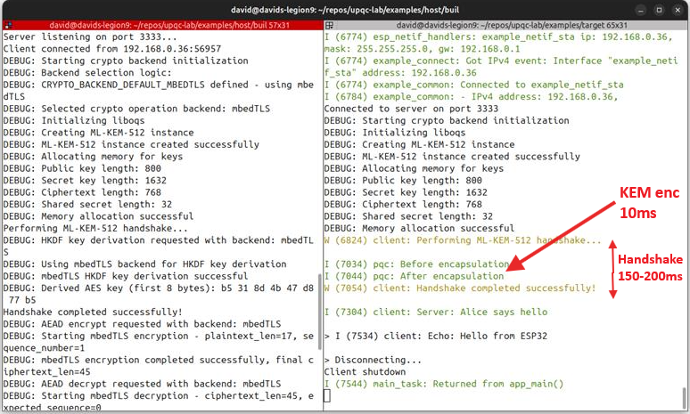
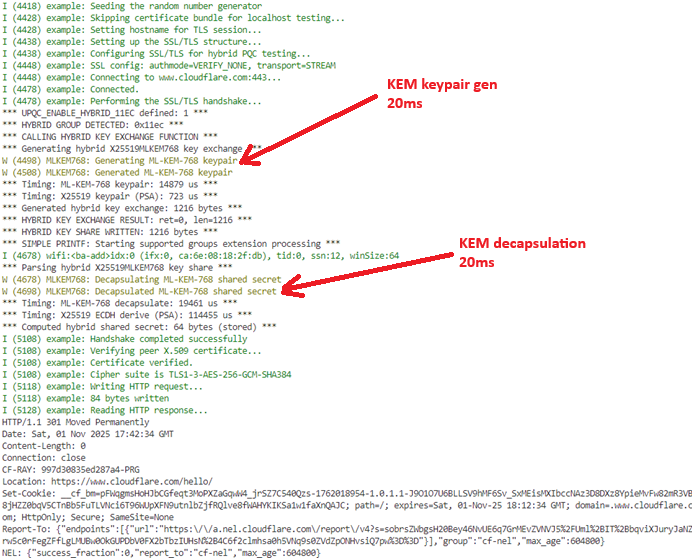

# **Intro to PQC for Embedded devs**


## David Cermak, Embedded developer

---

## Why Post-Quantum, Why Now

- **Harvest-now, decrypt-later** risk for long-lived data and devices
- <mark>**Trust Now, Forge later** risk for OTA</mark>
  - Forged signatures break secure boot and OTA
- Embedded/IoT lifetimes span decades; roots of trust must endure
- Standards have landed: **FIPS 203/204/205**; hybrid transition paths exist

---

# TLS handshake worldwide

## HTTP requests by post-quantum support time series

* Public telemetry shows rapid growth (~15% to ~50%) in the last year


#### Cloudflare Radar: https://radar.cloudflare.com

---

### OpenSSH ~10.2 warns about non-pq key exchange


---

## Quantum Threat Landscape

- Shor’s algorithm breaks RSA/ECC
- Classical PKI becomes forgeable
- Practical response: start migration with
    * **crypto agility** 
    * **hybrids**
- Prioritize integrity use cases (boot/OTA) alongside confidentiality (transport/storage).

---

## PQC Building Blocks & Standards

- KEM: **ML‑KEM (Kyber) 512/768/1024**
- Signatures: **ML‑DSA (Dilithium), SLH‑DSA (SPHINCS+), Falcon**
- Hybrid crypto: combine classical + PQ for transition safety

---

## Embedded Constraints

- Tighter RAM/flash, CPU/energy budgets; larger PQ artifacts
  - e.g., ML‑DSA sigs ~2–3 KB; ML‑KEM public keys ~1.1 KB.
- Side-channel hardening, careful memory planning, zeroization
- Prefer constant‑time, vetted implementations; enable crypto agility

---

### Sign Today, Forge Tomorrow (STFT)
### Trust Now, Forge Later (TNFL)

- Forged signatures undermine secure boot, OTA, device identity — compromise is immediate and often invisible
- Long lifecycles (15–30 yrs), limited patch windows for bootloaders, hard‑coded crypto and roots set at manufacture amplify risk
- Mitigations: crypto‑agility, update roots of trust (TPM/HSM/SE), full crypto inventory, staged PQC rollout; gateway validation when devices can’t update
- Underrated vs HNDL — prioritize integrity and safety alongside confidentiality in migration plans

---

## PQC Secure Boot — Why and What

- First PQC use case: software/firmware signing per CNSA 2.0 (by 2025)
- Store PQ public keys in ROM/OTP; verify each boot stage's signature
- Ensure algorithm agility in bootloaders and OTA verifiers
- PQC replaces RSA/ECDSA in verification; keep symmetric AES (prefer AES‑256)


---

## PQC Signature Choices (for Boot)

- ML‑DSA (Dilithium): stateless lattice; unlimited signs; larger keys; variable signing time
  - plan hybrids
- LMS/XMSS: stateful hash‑based; small, fast verify; ideal for boot; requires state management
  - standalone

**Hybrid Signatures & Crypto Agility**

---

## Tooling & Libraries

- wolfBoot: LMS/XMSS, ML‑DSA, hybrid auth; portable; HW accel support
- ST X‑CUBE‑PQC: LMS/XMSS verify, ML‑DSA/ML‑KEM for STM32
- PQShield PQMicroLib‑Core: tiny PQC for MCUs; constant‑time; DPA (Differential Power Analysis) aware

---

## Demo #1: Dedicated Secure Channel (ESP32)

- Goal: **ML‑KEM‑512 key exchange → AES‑GCM data channel**
- Highlight: small stack deltas; feasible on embedded targets

```bash
cd examples/host && mkdir -p build && cd build
cmake -DCRYPTO_BACKEND_DEFAULT=openssl .. && make
./bin/server
```

Run ESP32 target (encrypted echo over TCP):

```bash
cd examples/target
idf.py build flash monitor
```
---

## Demo #1: Dedicated Secure Channel

- Dedicated secure channel with ML‑KEM‑512 handshake feeding an AES‑GCM data channel.
- Server publishes Kyber public key; client encapsulates to derive a shared secret.
- Both sides derive an AES‑GCM key; subsequent payloads are encrypted symmetrically.
- This pattern generalizes beyond TLS and fits embedded transports well.

---

## Demo #1: Dedicated Secure Channel


---

## Demo #1: Dedicated Secure Channel



---

## Demo #1: Overheads and sizing

- KEM handshakes add kilobytes to key shares and about 10ms one‑time latency.
- ESP32 performs only KEM encapsulation (client side)
- keypair generation and decapsulation are executed on server side
- Steady‑state throughput uses symmetric crypto, so data rates remain unchanged.
- Measure on target hardware; cache and toolchain choices affect timing.

---

## Demo #2: TLS 1.3 Hybrid X25519 + ML‑KEM‑768

- Client: `hybrid/target_client` (ESP‑IDF Linux port or ESP32)
- Server: OpenSSL 3.5+ with group `X25519MLKEM768` (IANA 0x11EC)

Build client:

```bash
cd hybrid/target_client
idf.py build
```

Start local TLS server (terminal A):

```bash
openssl s_server -accept 8443 -tls1_3 -cert cert.pem -key key.pem \
  -www -msg -debug -groups X25519MLKEM768
```

Expect: "Handshake completed successfully" and server prints negotiated group `X25519MLKEM768`.

---



---

## Demo #2: TLS 1.3 Hybrid X25519 + ML‑KEM‑768

- X25519MLKEM768 negotiates classical X25519 and ML‑KEM‑768 key shares.
- Expect larger key shares and slightly longer handshake; connection security strengthens.
- ClientHello/ServerHello KeyShare lengths grow (~1.1–1.2 KB per side) versus classical‑only.
- Confirm negotiated hybrid group in server debug output.

---

## Demo #2: Inspecting the Hybrid Handshake

```bash
sudo tshark -i lo -Y "tls.handshake.extensions_supported_groups || tls.handshake.extensions_key_share" -O tls
```
- Supported Groups includes `0x11ec`
- ClientHello KeyShare length `1216`; ServerHello `1120`

* [capture](https://github.com/david-cermak/upqc-lab/blob/main/hybrid/target_client/capture.txt)

- Use tshark filters for supported_groups and key_share extensions.
- Confirm both classical and PQ key shares are present and the hybrid group is selected.

---

## Key Takeaways

- Start with roots of trust (firmware signing), then update transports.
- Use hybrids during transition
- Design for algorithm agility

---

## Timings of ML-KEM-768 on ESP32@160MHz

| Operation | Time (ms) |
|-----------|-----------|
| Keypair   | 17.538    |
| Encaps    | 19.926    |
| Decaps    | 22.905    |


---

## Footprints of ML-KEM-768 on ESP32

| Metric | Value |
|--------|-------|
| Stack Used | 15,188 bytes |
| Heap Usage | 224 bytes |


| Total Size | Flash Code (.text) | Flash Data (.rodata) |
|------------|-------------------|---------------------|
| 10,8 bytes | 10,3 bytes | 448 bytes |

---

## Metrics on ESP32

- Stack usage ~15 KB; heap ~224 B for ML‑KEM‑768 operations in this demo.
- Static code size of the ML‑KEM component is modest for embedded targets.
- Tune stack sizes and minimize dynamic allocation; prefer static buffers.
- At 160 MHz, ML‑KEM‑768 costs: ~20ms for each operation (keypair, encaps, decaps).

---

## Links

* [uPQC-lab](https://github.com/david-cermak/upqc-lab)
    - [dedicated-channel](https://github.com/david-cermak/upqc-lab/tree/main/examples#pqc-channel-demo-host--esp32)
    - [hybrid-groups](https://github.com/david-cermak/upqc-lab/tree/main/hybrid)
* [STFT/TNFL risk](https://postquantum.com/post-quantum/trust-now-forge-later/)
* [NIST](https://www.nist.gov)
    * [CNSA 2.0 timeline](https://garantir.io/keeping-software-secure-in-a-post-quantum-world/#:~:text=The%20timeline%20for%20adoption%20is,should%20be%20completed%20by%202035)

* [wolfSSL](https://www.wolfssl.com/products/wolfcrypt-post-quantum/), [wolfBoot](https://www.wolfssl.com/wolfboot-secure-boot-and-more-unique-features-to-assist-and-optimize-firmware-updates/)
* [ST X‑CUBE‑PQC](https://newsroom.st.com/media-center/press-item.html/n4680.html)
* [PQShield](https://pqshield.com), [Secure boot considerations](https://pqshield.com/secure-boot-considerations-with-pqc/)
