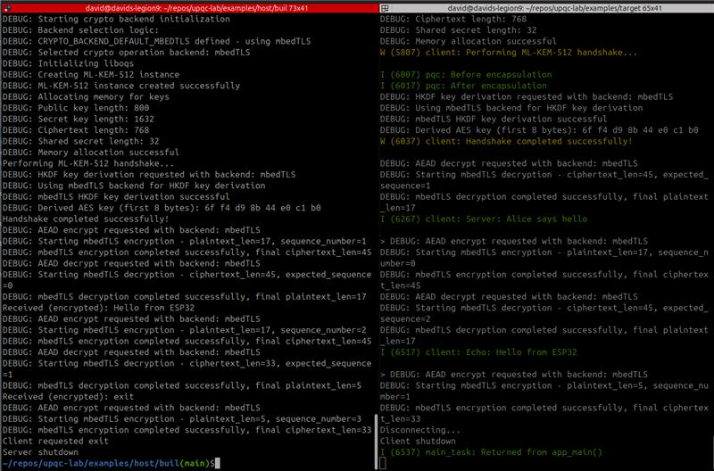

# **Intro to PQC for Embedded devs**


## David Cermak, Embedded developer

---

## Why Post-Quantum, Why Now

- **Harvest-now, decrypt-later** risk for long-lived data and devices
- <mark>**Sign Today, Forge Tomorrow** risk for OTA</mark>
- Embedded/IoT lifetimes span decades; roots of trust must endure
- Standards have landed: **FIPS 203/204/205**; hybrid transition paths exist

---

# TLS handshake worldwide

## HTTP requests by post-quantum support time series

 * From ~15% to ~50% in the last year


---

# OpenSSH ~10.2 warns about non-pq key exchange


---

## Quantum Threat Landscape

- Shor breaks RSA/ECC; classical PKI becomes forgeable
- Network captures today become plaintext tomorrow
- Practical response: start migration with
    * **crypto agility** 
    * **hybrids**

---

### Sign Today, Forge Tomorrow (STFT)
### Trust Now, Forge Later (TNFL)

- Forged signatures undermine secure boot, OTA, device identity — compromise is immediate and often invisible
- Long lifecycles (15–30 yrs), limited patch windows for bootloaders, hard‑coded crypto and roots set at manufacture amplify risk
- Mitigations: crypto‑agility, update roots of trust (TPM/HSM/SE), full crypto inventory, staged PQC rollout; gateway validation when devices can’t update
- Underrated vs HNDL — prioritize integrity and safety alongside confidentiality in migration plans

---

## Firmware Signing & Secure Boot Risks

- If firmware signatures (RSA/ECDSA) are broken, malicious updates pass verification
- Protect the root of trust first: adopt **ML‑DSA / SLH‑DSA**, plan hybrids
- Ensure algorithm agility in bootloaders and OTA verifiers

---

## PQC Building Blocks & Standards

- KEM: **ML‑KEM (Kyber) 512/768/1024**
- Signatures: **ML‑DSA (Dilithium), SLH‑DSA (SPHINCS+), Falcon**
- Hybrid crypto: combine classical + PQ for transition safety

---

## Embedded Constraints

- Tighter RAM/flash, CPU/energy budgets; larger PQ artifacts
- Side-channel hardening, careful memory planning, zeroization
- Prefer constant‑time, vetted implementations; enable crypto agility

---

## Demo #1: Dedicated Secure Channel (ESP32)

- Goal: **ML‑KEM‑512 key exchange → AES‑GCM data channel**
- Highlight: small stack deltas; feasible on embedded targets

```bash
cd examples/host && mkdir -p build && cd build
cmake -DCRYPTO_BACKEND_DEFAULT=openssl .. && make
./bin/server
```

Run ESP32 target (encrypted echo over TCP):

```bash
cd examples/target
idf.py build flash monitor
```
---

## Demo #1: Dedicated Secure Channel


---

## Demo #1: Dedicated Secure Channel



---

## Demo #2 — TLS 1.3 Hybrid X25519 + ML‑KEM‑768

- Client: `hybrid/target_client` (ESP‑IDF Linux port or ESP32)
- Server: OpenSSL 3.5+ with group `X25519MLKEM768` (IANA 0x11EC)

Build client:

```bash
cd hybrid/target_client
idf.py build
```

Start local TLS server (terminal A):

```bash
openssl s_server -accept 8443 -tls1_3 -cert cert.pem -key key.pem \
  -www -msg -debug -groups X25519MLKEM768
```

Expect: "Handshake completed successfully" and server prints negotiated group `X25519MLKEM768`.

---

## Inspecting the Hybrid Handshake (optional)

```bash
sudo tshark -i lo -Y "tls.handshake.extensions_supported_groups || tls.handshake.extensions_key_share" -O tls
```
- Supported Groups includes `0x11ec`
- ClientHello KeyShare length `1216`; ServerHello `1120`

---

## Migration Strategy

- Start at the root of trust: PQ firmware signing, then transport
- Use hybrids during transition; design for algorithm agility
- Verify interoperability; measure latency and memory on target

---

## Key Takeaways

- **PQC is production‑ready**; embedded migration must start now
- **Hybrid deployments** are the pragmatic path
- Demos show feasibility on real targets (dedicated channel + TLS 1.3 hybrid)

---

## Links

* [uPQC-lab](https://github.com/david-cermak/upqc-lab)
    - [dedicated-channel](https://github.com/david-cermak/upqc-lab/tree/main/examples#pqc-channel-demo-host--esp32)
    - [hybrid-groups](https://github.com/david-cermak/upqc-lab/tree/main/hybrid)
* [STFT/TNFL risk](https://postquantum.com/post-quantum/sign-today-forge-sftf-tnfl/?utm_source=chatgpt.com)

---

## PQC Secure Boot — Why and What

- First PQC use case: software/firmware signing per CNSA 2.0 (by 2025)
- Store PQ public keys in ROM/OTP; verify each boot stage’s signature
- PQC replaces RSA/ECDSA in verification; keep symmetric AES (prefer AES‑256)

Refs: [PQShield](https://pqshield.com/secure-boot-considerations-with-pqc/), [NIST](https://www.nist.gov)

---

## PQC Signature Choices (for Boot)

- ML‑DSA (Dilithium): stateless lattice; unlimited signs; larger keys; variable signing time
- LMS/XMSS: stateful hash‑based; small, fast verify; ideal for boot; requires state management

Ref: [ST Wiki](https://wiki.st.com), [PQShield](https://pqshield.com)

---

## Hybrid Signatures & Crypto Agility

- PQ/T hybrid: sign firmware with classical + PQ; verify both (CNSA 2.0)
- Pros: backward compatibility, defense‑in‑depth; gradual migration
- Cons: bigger images, more code/latency; plan key slots/versioning

Ref: [PQShield](https://pqshield.com), [wolfSSL/wolfBoot](https://www.wolfssl.com/wolfboot-secure-boot-and-more-unique-features-to-assist-and-optimize-firmware-updates/)

---

## Tooling & Libraries

- wolfBoot: LMS/XMSS, ML‑DSA, hybrid auth; portable; HW accel support
- ST X‑CUBE‑PQC: LMS/XMSS verify, ML‑DSA/ML‑KEM for STM32
- PQShield PQMicroLib‑Core: tiny PQC for MCUs; constant‑time; DPA‑aware

Refs: [wolfSSL](https://www.wolfssl.com/products/wolfcrypt-post-quantum/), [ST X‑CUBE‑PQC](https://newsroom.st.com/media-center/press-item.html/n4680.html), [PQShield](https://pqshield.com)

---

## Practical Considerations

- Size: PQ keys/signatures are KB‑scale; budget flash and OTA bandwidth
- Performance: verify slower than ECDSA; usually OK per‑boot; measure on target
- Stateful keys: persist counters (LMS/XMSS); define update limits and process
- Bootloader: new formats/parsers; constant‑time; testing; FIPS/CAVP path

Ref: [ST Wiki](https://wiki.st.com), [PQShield](https://pqshield.com)

---

## Hardware & TLS Ecosystem

- Emerging PQC in MCUs/SE/TPMs (e.g., Microchip PIC64‑HPSC with ML‑DSA/ML‑KEM)
- TLS: wolfSSL supports Kyber/Dilithium; mbed TLS to follow finalized standards

Refs: [Microchip IR](https://ir.microchip.com), [wolfSSL](https://www.wolfssl.com/products/wolfcrypt-post-quantum/), [mbed TLS](https://lists.trustedfirmware.org/archives/list/mbed-tls@lists.trustedfirmware.org/)

---

## Flash Encryption Note

- Symmetric crypto remains viable; use AES‑256 for ~128‑bit post‑quantum strength
- PQC KEMs can help with key management, but on‑chip key storage is common

Ref: [Research summary](https://www.nist.gov)

---

## Next Steps for Your Team

- Inventory boot chains and signature uses; find hard‑coded roots
- Choose scheme: LMS/XMSS for boot; ML‑DSA if unlimited signing needed
- Prototype on target; measure size/latency; add hybrid if mandated
- Plan crypto agility: multi‑key slots, versioning, rollback; side‑channel tests

