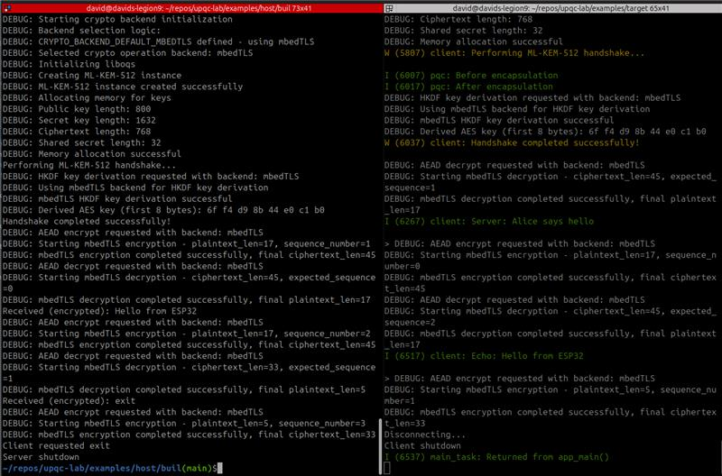

# PQC Channel Demo (Host + ESP32)

This example establishes a post-quantum secure TCP channel between a Linux host (server) and an ESP32 (client).

Cryptography
- KEM: ML‑KEM‑512 or ML‑KEM‑768 (Kyber) via liboqs
- KDF: HKDF-SHA256
- AEAD: AES-256-GCM, AAD includes a 32-bit sequence number
- Record layout: [IV (12B)] [Ciphertext] [Tag (16B)]

Default network parameters
- Server listens on TCP port `3333`
- Client connects to `SERVER_IP` (set in `examples/target/main/client.c`)

## Requirements
- Host: Linux, `cmake` ≥ 3.15, C compiler. For OpenSSL backend, install OpenSSL 3.x dev headers. mbedTLS builds from `impl/mbedtls`.
- ESP32: ESP‑IDF installed and configured (`idf.py` on PATH), supported ESP32 board and serial access, Wi‑Fi connectivity to the host’s network.

## Build and Run — Host (Linux)
1) Configure and build
   - `cd examples/host && mkdir -p build && cd build`
   - Choose KEM size (optional): add `-DUPQC_KEM_LEVEL=768` for ML‑KEM‑768; default is 512
   - OpenSSL backend (default): `cmake -DCRYPTO_BACKEND_DEFAULT=openssl -DUPQC_KEM_LEVEL=512 .. && make -j`
   - mbedTLS backend: `cmake -DUSE_OPENSSL_BACKEND=OFF -DUSE_MBEDTLS_BACKEND=ON -DCRYPTO_BACKEND_DEFAULT=mbedtls -DUPQC_KEM_LEVEL=512 .. && make -j`
2) Run server
   - `./bin/server`
   - Ensure firewall allows TCP/3333 and note the host IP reachable by the ESP32.

## Build and Run — ESP32 (Client)
1) Configure server IP
   - Edit `examples/target/main/client.c` and set `#define SERVER_IP "<host_lan_ip>"` (default port is 3333).
2) Configure Wi‑Fi
   - `cd examples/target`
   - `idf.py menuconfig` → Example Connection Configuration → set SSID/PASS (uses `protocol_examples_common`).
3) Build/flash/monitor
   - (Optional) set target: `idf.py set-target esp32`
   - Select KEM size (optional): append `-DUPQC_KEM_LEVEL=768` for ML‑KEM‑768; default is 512
   - `idf.py -DUPQC_KEM_LEVEL=512 build flash monitor`
4) Expected logs
   - Client: connects, performs ML‑KEM‑512/768 handshake, sends one message, then `exit`.
   - Server: prints client address, handshake success, echoes received data, then exits.

## Troubleshooting
- Connection failed: verify `SERVER_IP`, same L2 network/VLAN, and host firewall rules.
- Handshake failed: rebuild both sides, keep backends consistent (HKDF/AES‑GCM are interoperable across OpenSSL/mbedTLS).
- OpenSSL errors: ensure version 3.x; otherwise prefer the mbedTLS backend.

Notes
- Source trees: host at `examples/host`, ESP32 at `examples/target`.
- Do not edit generated build artifacts under `examples/*/build/`.

## KEM Selection (shared)
- The shared header `examples/shared/upqc_config.h` controls the parameter set.
- Set `-DUPQC_KEM_LEVEL=512` or `768` at configure time on both host and target builds.
- ESP32 build also sets `KYBER_K` accordingly under the hood for the Kyber reference.

## ESP32 Encapsulation Timing
- The ESP32 client measures ML‑KEM encapsulation time using `esp_timer_get_time()`.
- Look for log `Encaps time: <us> us (<ms> ms)` around the handshake.
